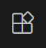
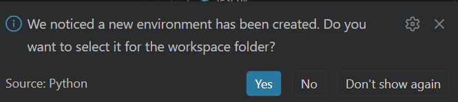

# Introduction

Cette semaine, l'objectif n'est pas de devenir expert Python, mais d'être capable de démarrer proprement un projet Python.

Vous connaissez déjà bien R et RStudio. L'idee est de traduire ces éléments dans l'écosystème Python et VS Code:

- créer un projet,
- installer des packages,
- exécuter du code,
- et garder un environnement reproductible.

En fin de lab, vous aurez:

1. installer VS Code et les extensions utiles;
2. installer Python;
3. créer un environnement virtuel;
4. installer les packages de base pour la science des données;
5. adapter un petit script de base.

# RStudio vs VS Code: correspondances rapides

| R/RStudio | Equivalent Python/VS Code |
|---|---|
| Projet `.Rproj` | Dossier de projet |
| `install.packages()` | `pip install ...` |
| `renv` | `venv` + `requirements.txt` |
| Script `.R` | Script `.py` |
| Knit `.Rmd` | Jupyter Notebook `.ipynb` |

Important: en Python, on isole generalement les dépendances dans un environnement virtuel par projet.

# 1) Installation de Python

## Windows

Installez Python depuis [python.org](https://www.python.org/downloads/).

De base, le site officiel propose d'installer le _Python install manager_. Il s'agit d'un outil en ligne de commande pour gérer les versions de Python. C'est une bonne option si vous voulez gérer plusieurs versions de Python sur votre machine. Une fois installé, la dernière version de python peut être installée avec (dans un terminal):

```bash
pymanager install default
```

## Verification

Dans un terminal:

```bash
python --version
```

Vous devez voir une version de Python (ex: Python 3.14.3).

# 2) Installation de VS Code et des extensions

## Installer VS Code

Si ce n'est pas déjà fait, téléchargez et installez VS Code depuis le [site officiel](https://code.visualstudio.com/).

## Extensions a installer

Dans VS Code, ouvrir l'onglet Extensions  et installer:

- Python (Microsoft)
- Pylance (Microsoft) - pour l'autocompletion et les diagnostics
- Jupyter (Microssoft) - pour les notebooks

Optionnel mais utile:

- GitLens

## Vérification

Créez un projet de test dans VS Code en créant un nouveau dossier et en ouvrant ce dossier dans VS Code (`File > Open Folder`).

Créez un fichier `test.py` avec le contenu:

```python
print("Hello World!")
```

La version de Python doit être reconnue (en bas à droite) et vous devriez avoir l'autocompletion dans le fichier.

Pour exécuter le script, vous pouvez faire un clic droit dans l'éditeur et choisir "Run Python File in Terminal". Vous devriez voir "Hello World!" dans le terminal.

Vous pouvez également utilisr le bouton run en haut à droite de l'éditeur. 

# 3) Créer un environnement virtuel

## Pourquoi?

Les environnements virtuels permettent d'isoler les dépendances d'un projet. Cela évite les conflits entre projets et garantit que votre projet est reproductible. Par exemple, si vous avez deux projets qui utilisent des versions différentes de `pandas` ou de python, les environnements virtuels permettent de gérer cela facilement.

## Depuis le terminal

Vous pouvez ouvrir un terminal dans VS Code depuis le menu (`Terminal > New Terminal`) ou avec la palette de commandes (`Ctrl+Shift+P` et chercher "Terminal: Create New Terminal") et créer un environnement virtuel avec:

```bash
python -m venv .venv
```

L'interface devrait vous dire qu'un environnement virtuel a été détecté et vous proposer de l'activer. 



Si ce n'est pas le cas, vous pouvez l'activer manuellement.

```powershell
.\.venv\Scripts\Activate.ps1
```

## Depuis VS Code

1. Ouvrez la palette de commandes (`Ctrl+Shift+P`)
2. Tapez: `Python: Create Environment`
3. Choisissez `venv` et suivez les instructions.

## Verification

Pour commencer, un dossier `.venv` devrait être créé dans votre projet.

Vous pouvez vérifier que l'environnement est actif en regardant le terminal. Vous devriez voir le nom de l'environnement (ex: `(.venv)`) au début de la ligne de commande.

```
(.venv) PS C:\Users\Tim\Semaine4> 
```


# 4) Installer des packages

De manière similaire à R, python offre certaines fonctionnalités de base, mais sa force réside dans les packages externes. Il en existe une multitude pour la science des données, le machine learning, la visualisation, etc.

Packages de base pour commencer:

- numpy - pour les calculs numériques et les tableaux
- pandas - pour la manipulation de données
- matplotlib - pour la visualisation de données (basique et parfois un peu compliquée)
- seaborn - pour la visualisation de données (plus avancée)
- scikit-learn - pour le machine learning
- jupyterlab - pour l'environnement de développement interactif

Installation (assurez-vous que votre environnement virtuel est actif):

```bash
pip install numpy pandas matplotlib seaborn scikit-learn jupyterlab
```

Sauvegarder les dépendances du projet:

```bash
pip freeze > requirements.txt
```

Cela permet de garder une trace des versions exactes des packages utilisés dans le projet, ce qui est crucial pour la reproductibilité. Si vous partagez votre projet ou si vous voulez le réinstaller plus tard, vous pouvez utiliser ce fichier pour installer les mêmes versions des packages:

```bash
pip install -r requirements.txt
```

Vous verrez que si vous reprenez des projets faits par d'autres personnes, il y a souvent un fichier `requirements.txt` qui liste les dépendances du projet.


# 5) Mini-exercice: adapter un script

## Contexte

Vous recevez un script Python incomplet. Le but est de:

1. charger un fichier CSV,
2. nettoyer des valeurs manquantes,
3. entrainer un modele simple,
4. afficher une metrique.

## Donnees

Utiliser le fichier `labs/data/nobel.csv`.

## Script de depart

Creer un fichier `mini_exercice.py` avec le code suivant:

```python
import pandas as pd
from sklearn.model_selection import train_test_split
from sklearn.ensemble import RandomForestClassifier
from sklearn.metrics import accuracy_score

# 1) Charger les donnees
df = pd.read_csv("labs/data/nobel.csv")

# 2) Garder seulement des colonnes utiles
# TODO: adapter si necessaire selon les colonnes presentes
cols = ["category", "sex", "birth_country", "year"]
df = df[cols].copy()

# 3) Nettoyage simple
df = df.dropna()

# 4) Variable cible et variables explicatives
# Exemple: predire la categorie du prix Nobel
y = df["category"]
X = df[["sex", "birth_country", "year"]]

# 5) Encodage des variables categorielles
X = pd.get_dummies(X, drop_first=True)

# 6) Separation train/test
X_train, X_test, y_train, y_test = train_test_split(
	X, y, test_size=0.2, random_state=42, stratify=y
)

# 7) Modele
model = RandomForestClassifier(n_estimators=200, random_state=42)
model.fit(X_train, y_train)

# 8) Evaluation
pred = model.predict(X_test)
acc = accuracy_score(y_test, pred)
print(f"Accuracy: {acc:.3f}")
```

## Votre travail

- Verifier les noms de colonnes avec `print(df.columns)`.
- Adapter `cols` si une colonne n'existe pas.
- Remplacer la cible `y` par une autre variable (ex: `sex`) et observer l'impact.
- Changer le modele (ex: `LogisticRegression`) et comparer l'accuracy.

## Questions de reflection

1. Pourquoi doit-on encoder les variables categorielles?
2. Pourquoi separer train/test?
3. Pourquoi fixer `random_state`?
4. Que se passe-t-il si on ne retire pas les valeurs manquantes?

# Bonus: equivalent d'un notebook

Vous pouvez aussi travailler en notebook (`.ipynb`) dans VS Code.

Workflow minimal:

1. creer un notebook;
2. choisir le kernel Python `.venv`;
3. executer les cellules une par une;
4. exporter si necessaire.

# Recap

Si vous retenez 4 choses de ce lab:

1. un projet Python = un dossier + un `.venv`;
2. toujours selectionner l'interpreteur du projet dans VS Code;
3. installer les dependances dans l'environnement actif;
4. figer les dependances (`requirements.txt`) pour la reproductibilite.

# Pour aller plus loin

- Ajouter un fichier `README.md` avec les commandes d'installation.
- Apprendre `pytest` pour les tests unitaires.
- Tester `ruff` et `black` pour la qualite de code.
